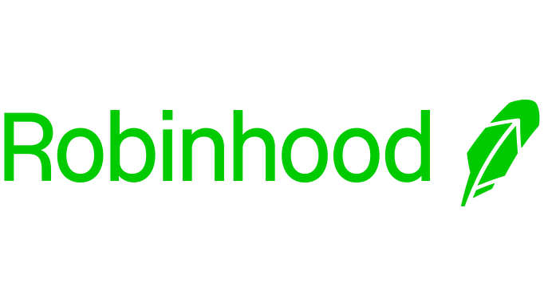

# Fintech2022-Case Study

## Unlimited commission free for trading
---
A solution for free-trading in financial market.

Group:

Napisa

Duc Luong

Adam

Dan

### Company overview
Robinhood Markets Inc. is a financial technology (fintech) company that operates an online discount brokerage offering commission-free trading.1 It provides a web- and mobile-based financial services platform that allows users to invest in and trade stocks, exchange-traded funds (ETFs), options, and American depositary receipts (ADRs). It also allows users to invest in certain cryptocurrencies based on their geographic location.

Robinhood makes money through payment for order flow, premium membership fees, stock loans, interest on uninvested cash, interchange fees related to its debit card, and other smaller revenue streams.

